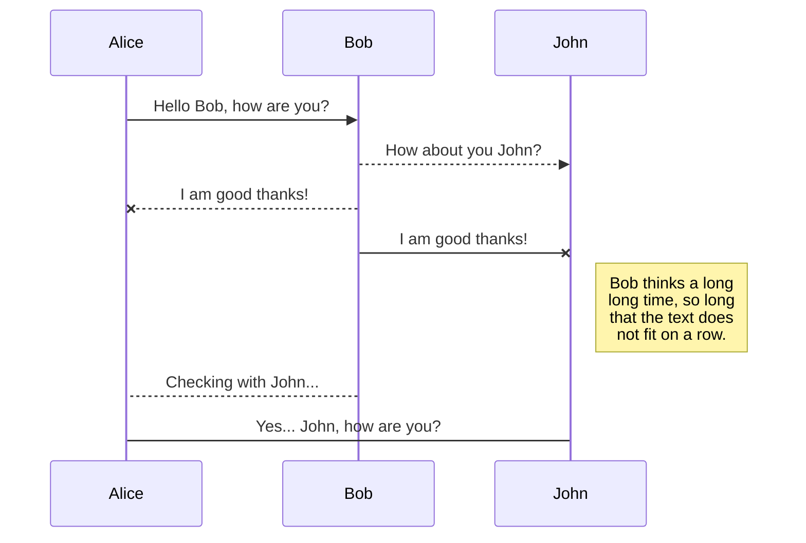
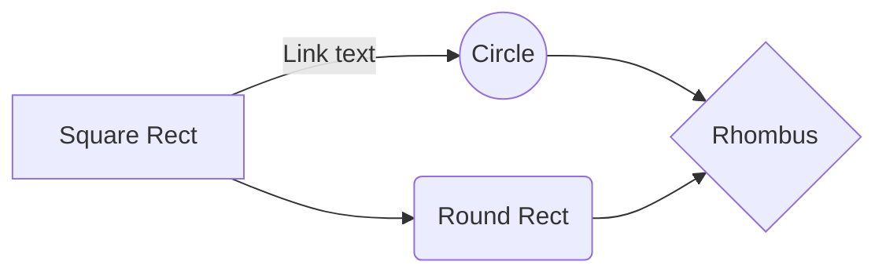

# Welcome to StackEdit!

Hi! I'm your first Markdown file in **StackEdit**. If you want to learn about StackEdit, you can read me. If you want to play with Markdown, you can edit me. Once you have finished with me, you can create new files by opening the **file explorer** on the left corner of the navigation bar.

# Prérequis

 

 - Visual Studio 2017 
		
		https://visualstudio.microsoft.com/fr/vs/older-downloads/

 - .NET Core 2.1 
 
		https://dotnet.microsoft.com/download/dotnet-core/2.1

# CApplicationDetectionObjets

## Attributs

 - Cimage image
 - CListeEnvironnementsIdentifiables listeEnvironnementsIdentifiables
 - CEnvironnement environnement
 - CListeObjetsIdentifiables listeObjetsIdentifiables
 -  CNuagePoints3D nuagePoint3D
 - CDetectionObjet detection
 - CScene3D scene3D
 - NDArray[] resultArr
 - List < SPositionObjetDansImage > listeSPositionObjetDansImage
 - string imageSortie

## Méthodes

 void ChargerEnvironnementsIdentifiables_depuisFichierXML(string fichierEnvironnemtsIdentifiables)

	Exemple:
	
	application.ChargerEnvironnementsIdentifiables_depuisFichierXML(@"..\EnvironnementsIdentifiables.xml");
---
void ChargerEnvironnementsIdentifiables_depuisXmlDocument(XmlDocument XMLEnvironnementsIdentifiables)

	Exemple:
	
	XmlDocument XMLEnvironnementsIdentifiables = new XmlDocument();
	ChargerEnvironnementsIdentifiables_depuisXmlDocument(XMLEnvironnementsIdentifiables);
---
void ChargerImageOrientee_depuisFichierXML(string fichierImageOrientee)

	Exemple:
	
	application.ChargerImageOrientee_depuisFichierXML(@"..\ImageOrientee.xml");
---
void ChargerImageOrientee_depuisXmlDocument(XmlDocument XMLImageOrientee)

	Exemple:
	
	XmlDocument XMLImageOrientee = new XmlDocument();
	application.ChargerImageOrientee_depuisXmlDocumentL(XMLImageOrientee);
---   

void ChargerNuagePoint3D_depuisFichierXML(string fichierNuagePoint3D)

	Exemple:
	
	application.ChargerNuagePoint3D_depuisFichierXML(@"..\NuagePoints3D.xml");
---   
void ChargerNuagePoints3D_depuisXmlDocument(XmlDocument XMLNuagePoints3D)

	Exemple:
	
	XmlDocument XMLNuagePoint3D = new XmlDocument();
	application.ChargerNuagePoint3D_depuisXmlDocument(XMLNuagePoint3D);
---   
void ChargerObjetsIdentifiables_depuisFichierXML(string fichierObjetsIdentifiables);
	
	Exemple:
	
	application.ChargerObjetsIdentifiables_depuisFichierXML(@"..\ObjetsIdentifiables.xml");
---   
void ChargerObjetsIdentifiables_depuisXmlDocument(XmlDocument XMLObjetsIdentifiables)
	
	Exemple:
	
	XmlDocument XMLObjetsIdentifiables = new XmlDocument();
	application.ChargerObjetsIdentifiables_depuisXmlDocument(XMLObjetsIdentifiables);
---   
void parametrerDetection(
 float Min_score = 0.5f, 
string pbFile = @"..\..\..\..\reseaux_neurones\frozen_inference_graph.pb",
string labelFile = @"..\..\..\..\reseaux_neurones\mscoco_label_map.pbtxt"
)

**Min_score** est le score minimum où l'on considère l'objet comme étant détecté.

**pbfile** est le chemin vers le modèle entrainé (extension .pb).

**labelfile** est le chemin vers le fichier contenant les labelles du modèle (extensions .pbtxt).

	Exemple:
	
	application.parametrerDetection(0.1f);
---   
void IdentifierObjets()

Cette méthode permet de démarrer la détection d'objet dans l'image.
 
	Exemple:
	
	application.IdentifierObjets();
---   
void PositionnerObjetsDansImage();

Cette méthode permet à l'application de récupérer l'emplacement des objets dans l'image.
Elle s'utilise **après** la méthode "void IdentifierObjet()".
	
	Exemple:
	
	application.PositionnerObjetsDansImage();
---   
void GenererImageSortie(string filename = "output.jpg")
**filename** est le chemin de l'image que l'on souhaite générer. Par défaut elle se nomme "output.jpg".
Sur cette image,   

	Exemple:
	
	application.GenererImageSortie(@"..\..\..\..\images\output.jpg");
---   
//Le paramètre est optionnel, c'est le chemin du fichier de sortie.

//application.GenererScene3d();

//application.ExporterScene3DversXMLDocument();

//application.ExporterScene3DversFichierXML(@"..\..\..\..\fichiers_XML\sortie.xml");

application.AfficherRenduDetectionImage();

//application.AfficherNuagePoints3D();

//application.AfficherScene3D();

//application.AfficherRenduDetectionConsole();

//application.AfficherObjetsIdentifiables();

//application.AfficherInfoImage();

//application.AfficherEnvironnemtsIdentifiables();

//application.AfficherTout();

## Diagramme de classes

You can render UML diagrams using [Mermaid](https://mermaidjs.github.io/). For example, this will produce a sequence diagram:

And this will produce a flow chart:

